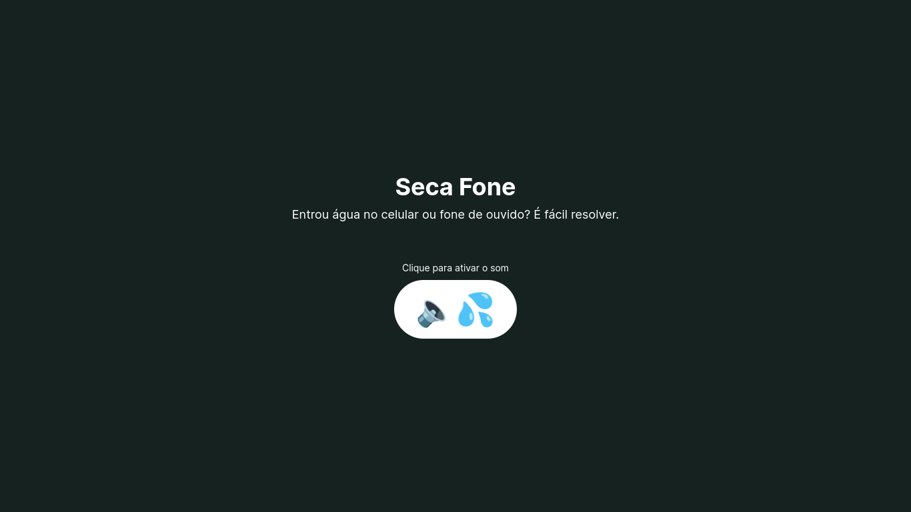

# secafone <a href="https://secafone.vercel.app"></a>

**Retire água da saída de som de seu celular, computador ou fones de ouvido.** 
O Secafone facilita o processo de retirada de água de um celular, fone de ouvido ou computador, após algum acidente. Com um clique no botão, será tocado um som que irá expelir a água através da saída de som.



## Instalação
```bash
# Clone o projeto
$ git clone https://github.com/luizhf42/secafone

# Acesse a pasta
$ cd secafone

# Instale as dependências
$ npm install

# Rode o projeto ─ o servidor irá iniciar em http://localhost:3000
$ npm run dev
```

## Contribua
Caso deseje contribuir com o Secafone, dê uma olhada no [guia de contribuição](CONTRIBUTING.md).

## Stack utilizada
- [Vue.js](https://vuejs.org)
- [Tailwind CSS](https://tailwindcss.com)
- [TypeScript](https://www.typescriptlang.org/)
- [Vercel](https://vercel.com) (deploy)